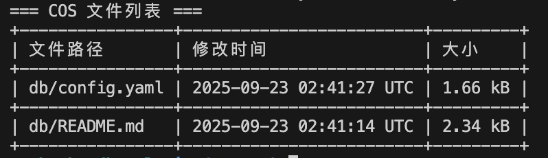

# 使用说明

一款基于 Rust 开发的数据库备份工具，支持单实例 PostgreSQL/MySQL 数据库的自动备份、加密、压缩，并可将备份文件上传至腾讯云 COS 或阿里云 OSS或兼容 S3 协议的其他云存储。

开发动机是本人维护着很多单体服务分布在各个云服务器上，每个单体服务都使用各自的数据库实例，因为甲方预算原因没有配置数据库主从备份。
但又有备份的需求，所以只好写个工具使用数据库自带的 dump 工具备份，再加密压缩上传到云存储。

## 功能特性

- 支持 PostgreSQL\MySql 数据库自动备份
- 备份文件自动加密、压缩
- 一键上传备份到腾讯云 COS\阿里云 OSS\兼容S3协议的其他云存储
- 支持备份文件的批量上传、批量删除、列表查看
- 支持自定义配置文件

## 前置条件

请确保服务器已安装 `7z`。  
安装命令（Debian/Ubuntu）：

```bash
sudo apt install p7zip-full
```

---

## 快速开始

1. 从 [release 页面](https://github.com/iKeepLearn/db-back-tool/releases) 下载可执行文件的 zip 包。
2. 解压后，修改其中的 `config.yaml` 配置文件为正确的配置。

---

## 常用命令示例

- **备份指定数据库**

  ```bash
  ./backupdbtool --config config.yaml backup <database_name>
  ```

- **上传所有待上传备份文件**

  ```bash
  ./backupdbtool --config config.yaml upload --all
  ```

- **上传单个备份文件**

  ```bash
  ./backupdbtool --config config.yaml upload --file /path/to/filename.ext
  ```

- **删除所有两天前的备份以减少云存储成本**

  ```bash
  ./backupdbtool --config config.yaml delete --all
  ```

- **删除单个云存储文件**

  ```bash
  ./backupdbtool --config config.yaml delete --key key
  ```
  > key 为云存储中的完整路径，比如想删除下方 list 中的 config.yaml 则 key 为 db/config.yaml。

  > 完整示例: ./backupdbtool --config config.yaml delete --key db/config.yaml。

- **列出所有备份文件**
  ```bash
  ./backupdbtool --config config.yaml list
  ```
  

## 定时任务（Cron）推荐配置

- **每日凌晨 2 点自动备份数据库**

  ```bash
  0 2 * * * /path/to/backupdbtool --config /path/to/config.yaml backup <database_name>
  ```

- **每日凌晨 2:30 上传所有待上传备份**

  ```bash
  30 2 * * * /path/to/backupdbtool --config /path/to/config.yaml upload --all
  ```

- **每周日凌晨 3 点删除所有两天前的备份以减少云存储成本**
  ```bash
  0 3 * * 0 /path/to/backupdbtool --config /path/to/config.yaml delete --all
  ```

> 请将 `/path/to/backupdbtool` 和 `/path/to/config.yaml` 替换为实际路径，`<database_name>` 替换为目标数据库名称。

## 联系方式

如有疑问，请联系开发者。


